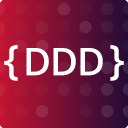
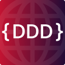
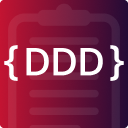

# Set of Domain-Driven Design (DDD) libraries for .NET

[](https://dotnet.microsoft.com)
[](LICENSE)

This repository contains a set of libraries that provide NuGet packages for Domain-Driven Design (DDD) in .NET. Because apparently we all need more packages in our lives.

*Setup your maintainable .NET website project today!*

See the [ROADMAP.md](./ROADMAP.md) for planned improvements, fixes, and open questions per package.

## MartinDrozdik.DDD

[](https://www.nuget.org/packages/MartinDrozdik.DDD)
[](https://www.nuget.org/packages/MartinDrozdik.DDD)
[](https://github.com/drozdik-m/domain-driven-design/actions)

**A pragmatic .NET library for Domain-Driven Design that doesn't force you into abstract nonsense (that much).**

Contains basic interfaces and building blocks for DDD and quality code, such as:

- **ValueObject, Entity, AggregateRoot**, ... (the usual suspects)
- **Object-based enumerations**
- **Validation** and **error handling** (based on `FluentValidation`, not your tears)
- **Type-safe ID** patterns (no more Guid soup)
- **Specifications** – composable business rules that return rich results, not just `bool` (And, Or, Not, Tautology, Contradiction)
- **Mediator** for commands and queries (with handlers) – integrated via DI
  - And **pipelines**!
- Other goodies that **make DDD easier without forcing** you into a specific architecture or framework

Check out [very nice README.md](./src/MartinDrozdik.DDD/README.md) for this library and possibly the [demo](./src/MartinDrozdik.DDD.Demo) for examples.

[](./src/MartinDrozdik.DDD/README.md)

## MartinDrozdik.DDD.Options


**`IOptions<T>` with a section convention and `FluentValidation`, without dragging ASP.NET Core into your business layer.**

Built on top of `MartinDrozdik.DDD`, this package provides configuration that fails fast:

- **`IAppOptions`** – options that know their own configuration section
- **`IValidatedAppOptions<T>`** – ...and their own `FluentValidation` validator
- **`AddAppOptions<T>()` / `AddValidatedAppOptions<T>()`** – strict binding, validated on start
- **Configuration manager extensions** – comfortably read options during startup, before the container exists

*No web host required.* Ideal for business layer.

Check out [very nice README.md](./src/MartinDrozdik.DDD.Options/README.md) for full details and examples that actually compile.

[](./src/MartinDrozdik.DDD.Options)

## MartinDrozdik.DDD.Web

[](https://www.nuget.org/packages/MartinDrozdik.DDD.Web)
[](https://www.nuget.org/packages/MartinDrozdik.DDD.Web)
[](https://github.com/drozdik-m/domain-driven-design/actions)

**Opinionated web infrastructure for ASP.NET Core that doesn't make you want to flip tables.**

Built on top of `MartinDrozdik.DDD`, this package provides all the web plumbing you'll need anyway:

- **One-liner setup** – `AddAppServices()` and `UseAppMiddlewares()` because life's too short for ceremony
- **Error handling**
- **Configuration validation** – with `FluentValidation`
- **Database helpers**
- **OpenTelemetry** – *Hello Aspire* (and any other OTLP-consumers)
- Basic **Health checks**
- **HTTP resilience**
- **OpenAPI**
- **Recurring background tasks** – on a schedule, or right now when you say so

*Everything is optional and composable.* Use what helps, ignore the rest. I won't tell.

Check out [very nice README.md](./src/MartinDrozdik.DDD.Web/README.md) for full details and examples that actually compile.

[](./src/MartinDrozdik.DDD.Web)

## MartinDrozdik.DDD.Testing

[](https://www.nuget.org/packages/MartinDrozdik.DDD.Testing)
[](https://www.nuget.org/packages/MartinDrozdik.DDD.Testing)
[](https://github.com/drozdik-m/domain-driven-design/actions)

**Common test tooling for the DDD libraries. Stop writing the same `WebApplicationFactory` boilerplate for every project.**

Built on top of [xUnit](https://github.com/xunit/xunit) and `MartinDrozdik.DDD.Web`, this package provides reusable test infrastructure:

- **`TestedApp` & `TestedAppBuilder`** – fluently configure your integration testing
- **Smoke tests** – free base classes for health checks, openapi, error handling and more
- **EF Core integration tests** – entity mapping, migrations, connectivity, and model compilation checks, all for free
- **Recurring tasks** – background loops off by default, run one iteration on demand, free per-task smoke tests
- **Assertions** – simplification of test assertions

*You still have to write your own tests. But at least you don't have to write the boring parts.*

Check out [very nice README.md](./src/MartinDrozdik.DDD.Testing/README.md) for full details and the [demo tests](./src/MartinDrozdik.DDD.Demo.Tests) for examples.

[](./src/MartinDrozdik.DDD.Testing)

## Claude Code Plugin

**Claude Code skills so your AI assistant actually knows how to use these libraries.**

Provides skills that give Claude deep knowledge of `MartinDrozdik.DDD`, `MartinDrozdik.DDD.Options`, `MartinDrozdik.DDD.Web`, and `MartinDrozdik.DDD.Testing`.

Install inside Claude Code:

```bash
/plugin marketplace add drozdik-m/domain-driven-design
/plugin install martin-drozdik-ddd
```

Check out [very nice Claude README.md](./claude/README.md) for further reading.

[](./claude/README.md)

## MartinDrozdik.DDD.Demo

[](https://github.com/drozdik-m/domain-driven-design/actions)

A demo application that shows recommended patterns for using the `MartinDrozdik.DDD`, `MartinDrozdik.DDD.Options` and `MartinDrozdik.DDD.Web` library. It's not gospel, but it works (which is more than you can say for most blog post code).

Check out:

- [Program.cs](./src/MartinDrozdik.DDD.Demo/Program.cs) – the entry point with minimal setup using the libraries
- [Models/](./src/MartinDrozdik.DDD.Demo/Models) – Aggregates, Entities, Value Objects, Enumerations
- [Requests/](./src/MartinDrozdik.DDD.Demo/Requests) – Commands and Queries with handlers
- [Context/](./src/MartinDrozdik.DDD.Demo/Context) – EF Core configuration with identity converters

The demo is structured for demonstration purposes. For real apps, consider vertical slice architecture. Or don't. You do you.

Check out [very nice README.md](./src/MartinDrozdik.DDD.Demo/README.md) for more details about the demo.

[](./src/MartinDrozdik.DDD.Demo)
